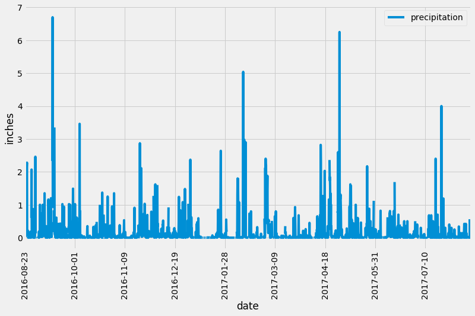
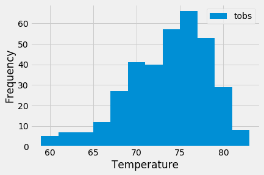
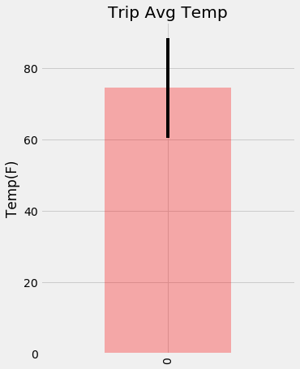
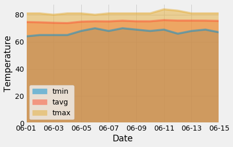

#  Surfs Up!

## Description
This project investigates a fictional trip to Hawaii. It analyzes the weather data for Hawaii collected at various weather stations to predict typical weather during the trip. This is done in the Jupyter notebook, while a Flask app is also created that allows data calls from a SQLite database using SQLAlchemy and Flask.

## Step 1 - Climate Analysis and Exploration
Use Python and SQLAlchemy to do basic climate analysis and data exploration of your climate database. All of the following analysis should be completed using SQLAlchemy ORM Queries, Pandas, and Matplotlib.

### Precipitation Analysis
  Design a Query to Retrieve the Last 12 Months of Precipitation Data Selecting Only the date and prcp Values
  Save the Query Results as a Pandas DataFrame and Set the Index to the Date Column & Sort the Dataframe Values by date
  Use Pandas Plotting with Matplotlib to plot the Data
  Use Pandas to Calculate the Summary Statistics for the Precipitation Data
### Station Analysis
  Design a Query to Show How Many Stations are Available in the Dataset
  List the Stations and Counts in Descending Order
  Which Station Had the Highest Number of Observations?
  Using the Station ID from the Previous Query, Calculate the Lowest Temperature Recorded, Highest Temperature Recorded, and Average Temperature of the Most Active Station
  Choose the Station with the Highest Number of Temperature Observations
  Design a Query to Retrieve the Last 12 Months of Temperature Observation Data for this Station

